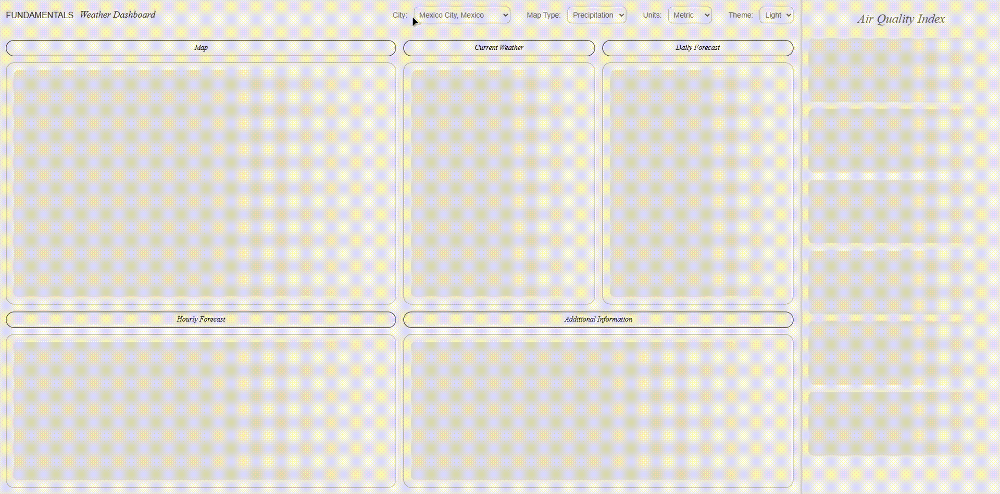

# WEATHER DASHBOARD

## Live Demo
https://weather.manfred.studio/

## Status
Completed

## Stack
- React 19
- TypeScript
- Vite
- CSS Modules
- TanStack Query
- Zod
- react-leaflet

## What is it
React Weather Dashboard built for my FUNDAMENTALS project. No AI-written code.

## What I learned
This was my first project using TanStack Query, Zod, and Leaflet, and each of them changed how I think about a piece of the problem.
- **TanStack Query** replaced a category of code I would otherwise have written badly. The dashboard has five endpoints keyed on coordinates that don't exist until a geocoding request resolves, the kind of dependency chain that turns into a tangle of `useEffect` and loading flags very quickly. Query's model is that the query key *is* the dependency: key a query on the coordinates, mark it `enabled: !!coordinates`, and it handles the rest. Changing the city updates one piece of state and the entire cascade refetches, deduplicates, and caches itself.
- **Zod** answered a question I hadn't thought to ask: what happens to my types at runtime? They don't survive. A TypeScript interface is a compile-time promise about data I don't control, and the API is free to break that promise at any point. Parsing each response through a schema at the boundary means a malformed payload fails immediately and legibly, rather than surfacing as an undefined property three components deep.
- **Leaflet** taught the sharpest lesson, because it doesn't play by React's rules. It's an imperative library wrapped in a declarative shell, and the seam between the two is invisible right up until you need the map to respond to something.

## One challenge I faced
Every component in the app up to that point had been declarative: props go in, JSX comes out, React reconciles the difference. Leaflet is the opposite, an imperative map engine that expects to be given commands. `react-leaflet` bridges the two, and for rendering a map that bridge is invisible. It stops being invisible the moment you need the map to *react* to something.

Changing the city updated every widget on the dashboard, but the map stayed exactly where it was. `MapContainer`'s `center` prop is read once, at creation, and ignored thereafter; passing new coordinates does nothing, because underneath there's a Leaflet object that was configured at mount and has been running its own life ever since.

The solution required a pattern I hadn't used: a child component rendered inside `MapContainer` whose only job is to run a side effect. It calls `useMap()` to reach the live Leaflet instance through React context, runs a `useEffect` keyed on the coordinates, and imperatively calls `map.setView()` when they change. It renders `null`. Its entire purpose is to be the seam between React's declarative world and Leaflet's imperative one.

## Some architecture decisions
- **Zod at the API boundary:** TypeScript types vanish at runtime, so a malformed API response would still slip through and fail somewhere deep in a component. Every fetch parses its response through a Zod schema before returning, which means bad data fails loudly at the edge rather than quietly in the middle. Schemas are modelled sparsely; only the fields actually used.
- **Dependent queries with TanStack Query:** Five endpoints all key on coordinates that don't exist until a geocoding request resolves. Rather than orchestrating that manually, each downstream query is chained with `enabled: !!coordinates` and keyed on the coords themselves. Changing the city updates one piece of state; Query handles the refetch cascade and caching from there.
- **Client-side unit conversion:** OpenWeatherMap can return imperial units directly, but the app was already transforming values at the boundary (m/s to km/h, metres to km). Handing temperature conversion back to the API would have meant unwinding those utilities and splitting the logic across two places. Keeping all conversion client-side is consistent, costs no extra API calls, and makes the units toggle instant rather than a refetch.
- **Transformation at the boundary, not in components:** Display components receive finished values and render them. Every unit conversion, timestamp format, and unit label is resolved in `lib/utils.ts`, and each widget's raw API response is shaped into its final props by a mapping function in `lib/mappers.tsx`. Components never touch the API's shape, and `App.tsx` reads as layout.
- **The AQI layout swap is pure CSS:** On desktop the air quality widget is a full-height side rail; below a breakpoint it becomes a horizontally-scrolling card inside the grid. Those are very different layouts, but they're the same component; the structure and logic are written once, and only the container is reshaped by media queries.
- **Absorbing an API migration mid-build:** OpenWeatherMap's One Call 4.0 restructured the previous all-in-one endpoint into separate modular ones, which arrived partway through the build. Because fetching, validation, and shaping were already isolated (`api.ts` to schemas to mappers), the change was contained to those layers. Not a single display component needed to change.
- **No ThemeProvider:** Theme is local state in App rather than a context provider, since it doesn't need to reach deeply nested components.

## What I'd do differently
- **Build one widget genuinely end-to-end first.** I built each widget's structure, styling, data layer, and responsive behaviour, but deliberately deferred loading states, error handling, and grid placement to a later phase. That deferral kept early momentum, but it meant a round of small refactors at the end: stripping scaffolding dimensions from every widget, moving `grid-area` declarations out of components and into layout wrappers, and retrofitting query states that had been destructured away. Next time I'd take a single widget all the way through, including its skeleton, its error state, and its final position in the layout, and only then repeat the pattern.
- **Consolidate utilities as they emerge, not after.** Three near-identical time formatters (`formatLocalTime`, `formatLocalTime2`, `formatLocalTime3`) accumulated one widget at a time, each one a copy-paste with the output tweaked. None was wrong, and each was the fastest thing to write in the moment, but by the end the same date-offset arithmetic existed in three places. Noticing the second one was a copy would have been the moment to extract the shared core.
- **Move the API key server-side.** The key is currently exposed in the client bundle, an acceptable trade-off for a free-tier portfolio piece but not for production. Project 4 addresses this directly by fetching through Next.js Server Components.

## Known limitations
- No live clock. Dashboard displays observation time ("As of:"), not real-time
- Data freshness bounded by OWM's update cadence (~10 min), so displayed time can lag wall-clock
- Cities are hardcoded (16 preset). Production would use free-text geocode search
- Native select dropdown menus are unstyleable. Production would use a custom Select primitive
- API key is client-side and visible in the bundle. Production would proxy through a serverless function (and note: Project 4 fixes exactly this with Server Components)
- Map is one-way (dropdown → map); no click-to-set-location, a deliberate scope decision given the fixed-city model
- Map legend uses approximate gradients, not OWM's exact color scales
- CARTO basemap is free/non-commercial tier. Commercial use would need a license or self-hosted tiles
- One generic skeleton shared across widgets. Production would have per-widget skeletons

## Running locally

The dashboard is deployed at [weather.manfred.studio](https://weather.manfred.studio); no setup needed to try it. To run it yourself, you'll need an OpenWeatherMap API key with a One Call subscription.

**1. Get an API key**
Create an OpenWeatherMap account, then subscribe to **One Call API 4.0** via the "One Call by Call" subscription (found on the pricing page). This is a pay-as-you-call model: the first 1,000 calls per day are free, and the subscription defaults to a 2,000 calls/day cap you can adjust in the Billing plans tab. Subscribing requires a payment method, but normal use of this dashboard stays comfortably within the free 1,000/day allowance. This project uses One Call API 4.0 for current, hourly, and daily weather, plus the Air Pollution API (available on the free tier without a subscription).

> **Note:** OpenWeatherMap's pricing and product tiers change over time. The details above are accurate as of July 2026. Please verify current terms on the pricing page before subscribing.

**2. Set up the environment**
From the `weather/` directory, create a `.env` file: VITE_OWM_KEY=your_api_key_here

The `VITE_` prefix is required — Vite only exposes prefixed variables to the client.

**3. Install and run**
```bash
cd weather
npm install
npm run dev
```

The app runs at `http://localhost:5173`.

> **Note:** New keys and subscription activation can take up to two hours to become active. If requests fail with 401 immediately after signing up, that's usually why.

## Demo GIF
